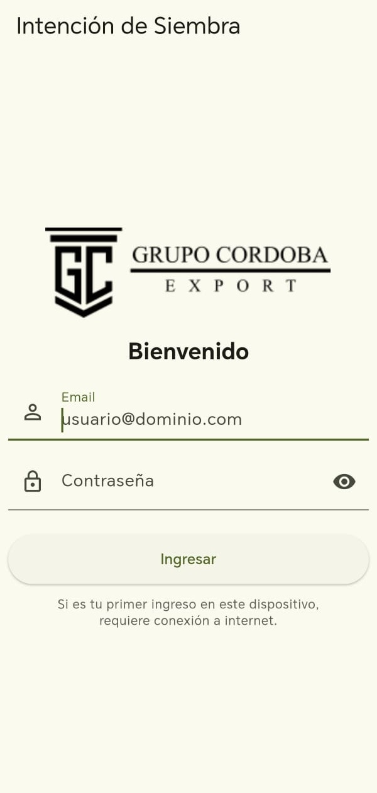
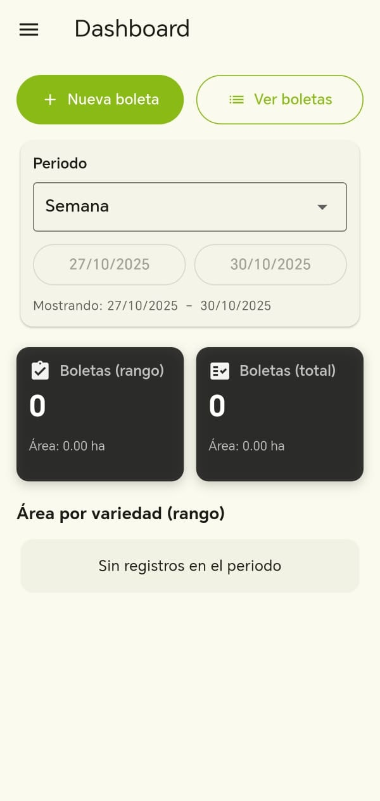
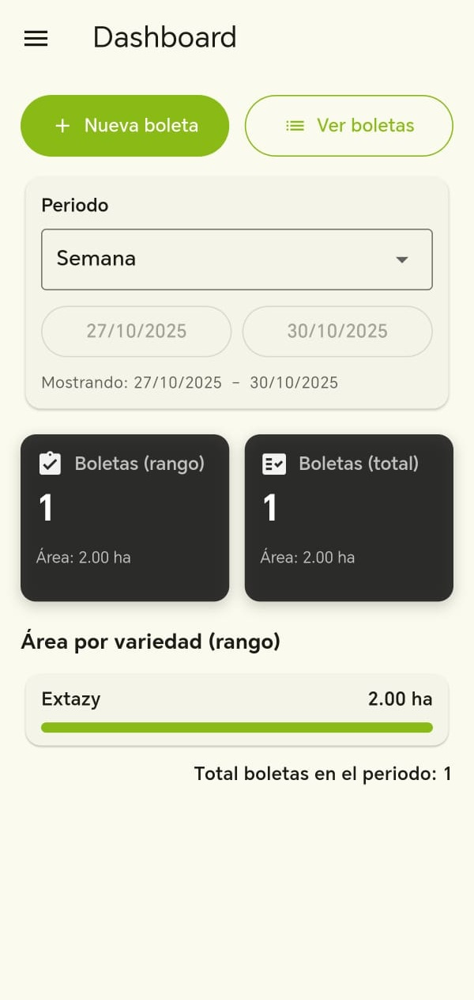
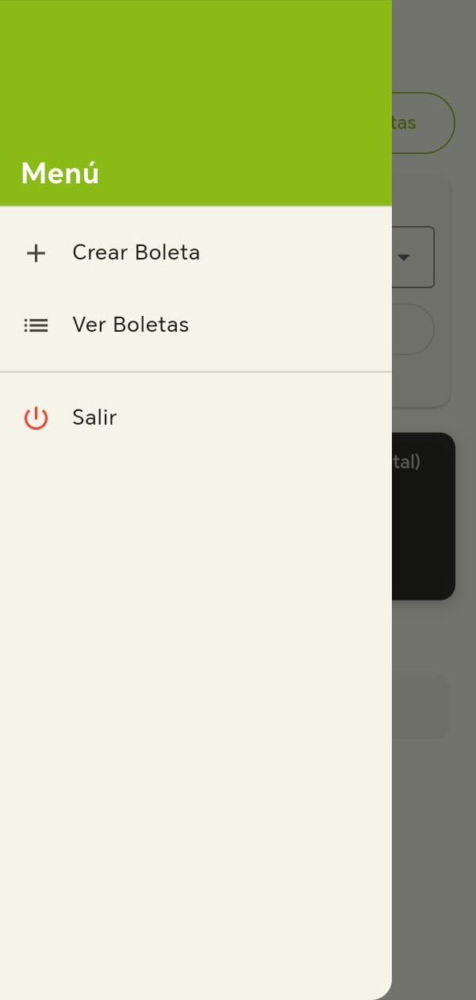
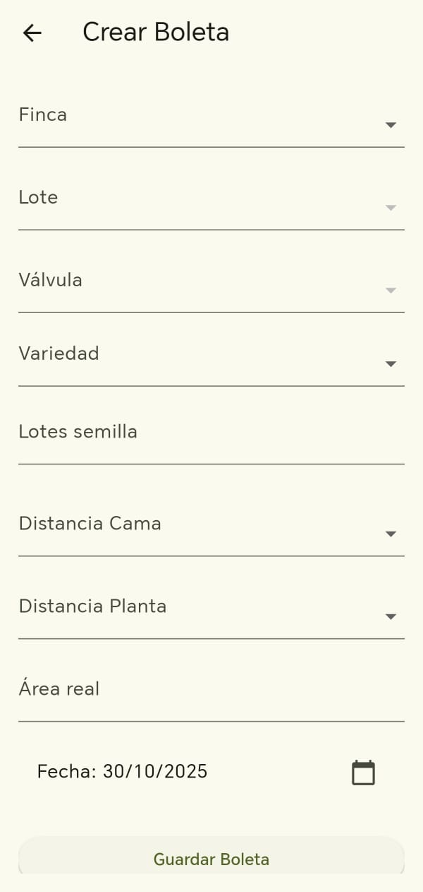
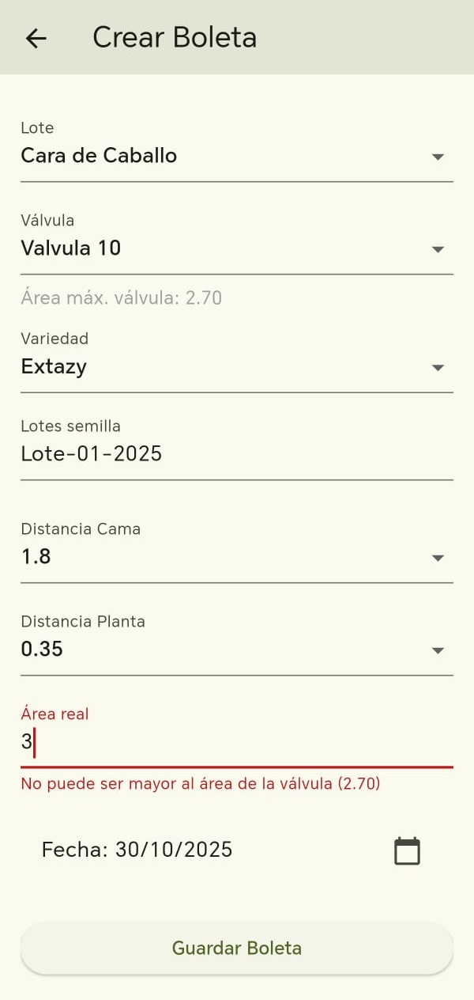
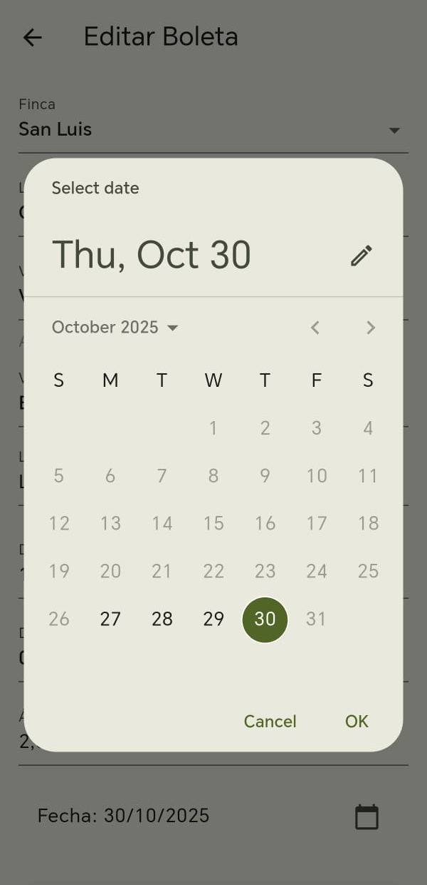
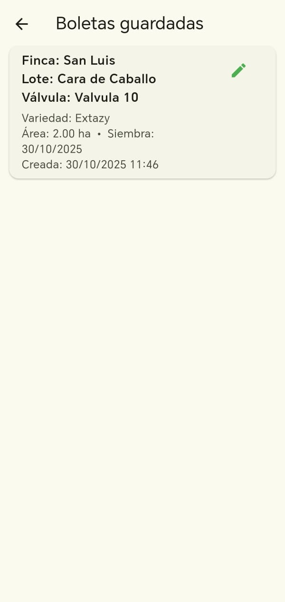
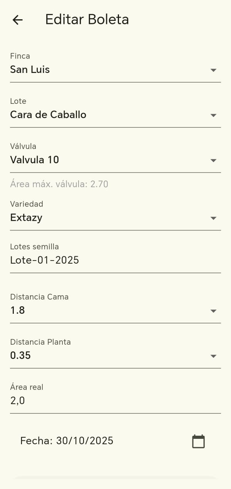

# Manual de Usuario — Intención de Siembra

**Versión:** 3.0  
**Fecha:** 30 de octubre de 2025

---

## 1. Introducción

Bienvenido al sistema de **Intención de Siembra**.

Esta aplicación permite a los productores agrícolas:
- Registrar boletas de siembra de forma digital
- Consultar y editar información de siembra
- Visualizar estadísticas y métricas en tiempo real
- Trabajar en modo offline cuando no hay conexión a Internet

El sistema está disponible como aplicación móvil (APK para Android) y cuenta con sincronización automática de datos.

---

## 2. Requisitos y acceso

### Requisitos técnicos
- Dispositivo Android (versión 5.0 o superior recomendada)
- Conexión a Internet (solo para el primer inicio de sesión y sincronización)
- Credenciales de acceso proporcionadas por el administrador del sistema

### Obtención de credenciales
Para obtener acceso al sistema, contacte con el administrador. Necesitará:
- Correo electrónico registrado
- Contraseña asignada

---

## 3. Iniciar sesión y cerrar sesión

### 3.1 Inicio de sesión

Para ingresar a la aplicación:

1. Ingrese su **correo electrónico** en el campo correspondiente
2. Ingrese su **contraseña**
3. Pulse el botón **"Ingresar"**

**Importante:**
- El **primer inicio de sesión** en un dispositivo requiere conexión a Internet
- Si ya inició sesión anteriormente, puede acceder en **modo offline**
- Las credenciales se almacenan de forma segura en el dispositivo

{ width=300px }

*Figura 1: Pantalla de inicio de sesión*

### 3.2 Cerrar sesión

Para salir de la aplicación de forma segura:

1. Abra el **menú lateral** (toque el ícono ☰)
2. Seleccione la opción **"Salir"**
3. La aplicación se cerrará completamente

---

## 4. App móvil (APK): descarga e instalación

### Descarga del APK

El archivo de instalación (APK) se obtiene a través del enlace proporcionado por el administrador del sistema.

### Instalación

1. Descargue el archivo APK en su dispositivo Android
2. Si es la primera vez que instala una aplicación de origen desconocido, active la opción:
   - **Configuración** → **Seguridad** → **Fuentes desconocidas** (permitir)
3. Abra el archivo APK descargado
4. Siga las instrucciones en pantalla para completar la instalación
5. Una vez instalada, encontrará el ícono de **Intención de Siembra** en su lista de aplicaciones

---

## 5. Conociendo el Dashboard

El Dashboard es la pantalla principal donde visualiza estadísticas, gráficos y accede a las funciones principales.

### Componentes principales

El Dashboard incluye:
- **Botones rápidos**: Nueva boleta y Ver boletas
- **Filtros**: Periodo, productor, material, variedad
- **Indicadores (KPIs)**: Métricas clave
- **Gráficos**: Visualización de datos
- **Tabla Top 10**: Principales registros

### 5.1 Filtros

Configure los filtros para personalizar la información mostrada:

**Filtro de periodo:**
- **Semana**: Datos de la semana actual
- **Mes**: Datos del mes en curso
- **Rango personalizado**: Seleccione fechas específicas

**Otros filtros disponibles:**
- Productor
- Material
- Variedad

{ width=300px }

*Figura 2: Vista del Dashboard sin datos registrados*

{ width=300px }

*Figura 3: Vista del Dashboard con datos y gráficos*

### 5.2 Indicadores (KPIs)

Los indicadores clave de rendimiento muestran:

**Cantidad de boletas:**
- Total de boletas en el periodo seleccionado
- Total general de boletas registradas

**Área total:**
- Área total sembrada en el periodo (rango)
- Área total acumulada (total)

Estos KPIs se actualizan automáticamente al cambiar los filtros.

### 5.3 Gráficos y tabla

**Gráfico de barras:**
- Muestra la distribución por **variedad** en el rango seleccionado
- Permite identificar rápidamente las variedades más sembradas

**Tabla Top 10:**
- Lista las 10 principales entradas según los criterios activos
- Información condensada para consulta rápida

---

## 6. Menú lateral

El menú lateral proporciona acceso rápido a las funciones principales.

### Abrir el menú

Toque el **ícono ☰** (tres líneas horizontales) ubicado en la esquina superior.

### Opciones disponibles

- **Crear Boleta**: Acceso directo al formulario de registro
- **Ver Boletas**: Listado de todas las boletas registradas
- **Salir**: Cerrar la aplicación de forma segura

{ width=300px }

*Figura 4: Menú con opciones principales*

---

## 7. Crear boleta

### Proceso de creación

Para registrar una nueva boleta de siembra:

1. Seleccione **Lote**
2. Seleccione **Válvula** (se muestra el área máxima disponible)
3. Seleccione **Variedad**
4. Seleccione **Lote de semilla**
5. Ingrese **Distancia Cama** (en metros)
6. Ingrese **Distancia Planta** (en metros)
7. Ingrese **Área real** a sembrar
8. Seleccione **Fecha de siembra** (si necesita modificar la fecha actual)
9. Pulse **"Guardar Boleta"**

### Validaciones importantes

**Validación de área:**
- El área real ingresada no puede superar el **Área máx. válvula**
- El sistema mostrará un mensaje de error si el valor es incorrecto

**Validación de fecha:**
- No se pueden registrar fechas futuras
- No se pueden registrar fechas con más de 3 días de antigüedad

{ width=300px }

*Figura 5: Formulario vacío de creación de boleta*

{ width=300px }

*Figura 6: Ejemplo de validación de área*

{ width=300px }

*Figura 7: Selector de fecha de siembra*

---

## 8. Ver y editar boletas

### Consultar boletas

En la opción **"Ver Boletas"** puede:
- Ver el listado completo de boletas del productor activo
- Consultar información detallada: Finca, Lote, Válvula, Variedad, Área, Fecha
- Los nombres se muestran completos (sin abreviaciones)

### Editar boletas

Para modificar una boleta existente:

1. Localice la boleta en el listado
2. Toque el **ícono de lápiz** al lado de la boleta
3. Realice los cambios necesarios
4. Guarde los cambios

**Restricción importante:**
- Solo se pueden editar boletas **creadas el mismo día**
- Las boletas de días anteriores quedan bloqueadas para edición

{ width=300px }

*Figura 8: Listado de boletas guardadas*

{ width=300px }

*Figura 9: Pantalla de edición de boleta*

---

## 9. Sincronización y modo offline

### Sincronización automática

Cuando inicia la aplicación con conexión a Internet:
- Se sincronizan automáticamente los **catálogos** (lotes, válvulas, variedades)
- Se envían al servidor las **boletas pendientes** de sincronización
- Se descargan las boletas nuevas creadas desde otros dispositivos

### Modo offline

Si no hay conexión a Internet:
- Aparece una **franja amarilla** indicando: *"Modo offline: usando datos locales"*
- Puede continuar creando y editando boletas normalmente
- Los datos se almacenan localmente en el dispositivo
- Al recuperar la conexión, todo se sincroniza automáticamente

### Sincronización manual

Para forzar la sincronización:
1. En el Dashboard, **arrastre hacia abajo** (pull-to-refresh)
2. El sistema intentará sincronizar inmediatamente
3. Se mostrará un indicador de progreso

---

## 10. Ejemplos rápidos de uso

### Ejemplo 1: Registro rápido de siembra matutina

1. Abra la app al llegar al campo
2. Toque **"Nueva boleta"** en el Dashboard
3. Seleccione: Lote "A1" → Válvula "V-10" → Variedad "Tomate Cherry"
4. Ingrese distancias y área según lo planificado
5. Guarde la boleta

**Tiempo estimado:** 2-3 minutos por boleta

### Ejemplo 2: Revisión de siembras de la semana

1. En el Dashboard, seleccione filtro **"Semana"**
2. Observe el KPI de **cantidad de boletas**
3. Revise el **gráfico de barras** para ver distribución por variedad
4. Toque **"Ver Boletas"** si necesita detalle completo

### Ejemplo 3: Trabajo en zona sin cobertura

1. Inicie sesión en la oficina (con Internet)
2. Diríjase al campo sin cobertura
3. La app detecta **modo offline** automáticamente
4. Registre boletas normalmente
5. Al regresar a zona con cobertura, todo se sincroniza

---

## 11. Preguntas frecuentes (FAQ)

### ¿Por qué no veo mis lotes o válvulas?

**Posibles causas:**
- Primera vez usando la app en este dispositivo
- Datos desactualizados

**Soluciones:**
1. Verifique su conexión a Internet
2. Realice un **pull-to-refresh** en el Dashboard (arrastre hacia abajo)
3. Si persiste, cierre y abra la app completamente
4. Contacte al administrador si el problema continúa

### ¿Por qué no puedo editar una boleta?

**Restricción del sistema:**
- Solo se pueden editar boletas **creadas el mismo día**
- Esta restricción protege la integridad de datos históricos

**Si necesita modificar una boleta antigua:**
- Contacte al administrador del sistema
- Puede crear una nueva boleta con la información corregida

### ¿Qué significa el error "Área real rechazada"?

**Causa:**
- El área ingresada supera el **Área máx. válvula**

**Solución:**
1. Revise el valor mostrado debajo del campo "Válvula"
2. Ingrese un área igual o menor
3. Si el área es correcta pero la válvula no, verifique la selección

### ¿Cómo funciona el modo offline?

**Funcionamiento:**
- La app almacena datos localmente en el dispositivo
- Puede crear/editar boletas sin Internet
- Al detectar conexión, sincroniza automáticamente
- Se muestra una franja indicadora cuando está offline

**Ventaja:**
- Trabajo ininterrumpido en zonas sin cobertura

### ¿Los datos se pierden si cierro la app en modo offline?

**No.** Los datos quedan guardados localmente y se sincronizarán cuando:
- Abra nuevamente la app con Internet
- La app detecte conexión automáticamente (en segundo plano)

### ¿Puedo usar la app en varios dispositivos?

**Sí.** Puede iniciar sesión en múltiples dispositivos con las mismas credenciales.

**Consideración:**
- Todos los dispositivos sincronizan con el servidor central
- Los datos están siempre actualizados en todos los dispositivos

---

## 12. Glosario

**APK**  
Android Package Kit. Formato de archivo para instalar aplicaciones en Android.

**Boleta**  
Registro digital de una siembra que incluye: lote, válvula, variedad, área, fecha y distancias.

**Dashboard**  
Pantalla principal que muestra resúmenes, gráficos e indicadores clave.

**KPI**  
Key Performance Indicator (Indicador Clave de Rendimiento). Métrica que muestra el desempeño del sistema.

**Lote**  
Subdivisión de terreno dentro de una finca destinada a cultivo.

**Modo offline**  
Funcionamiento de la app sin conexión a Internet, usando datos almacenados localmente.

**Pull-to-refresh**  
Acción de arrastrar hacia abajo en una pantalla para actualizar los datos.

**Sincronización**  
Proceso de enviar y recibir datos entre el dispositivo y el servidor central.

**Válvula**  
Sistema de riego asociado a un área específica dentro de un lote.

**Variedad**  
Tipo específico de cultivo o semilla (ej: Tomate Cherry, Pimiento Rojo).

---

## 13. Soporte

### Contacto

Para asistencia técnica o consultas sobre el sistema:

**Correo electrónico:** soporte@intencionsiembra.com  
**Horario de atención:** Lunes a Viernes, 8:00 AM - 5:00 PM

### Antes de contactar soporte

Tenga a mano la siguiente información:
- Versión de la aplicación
- Modelo de dispositivo Android
- Descripción detallada del problema
- Capturas de pantalla (si aplica)

### Recursos adicionales

- Manual técnico para administradores
- Guías de actualización
- Notas de versión

---

**Fin del manual**
